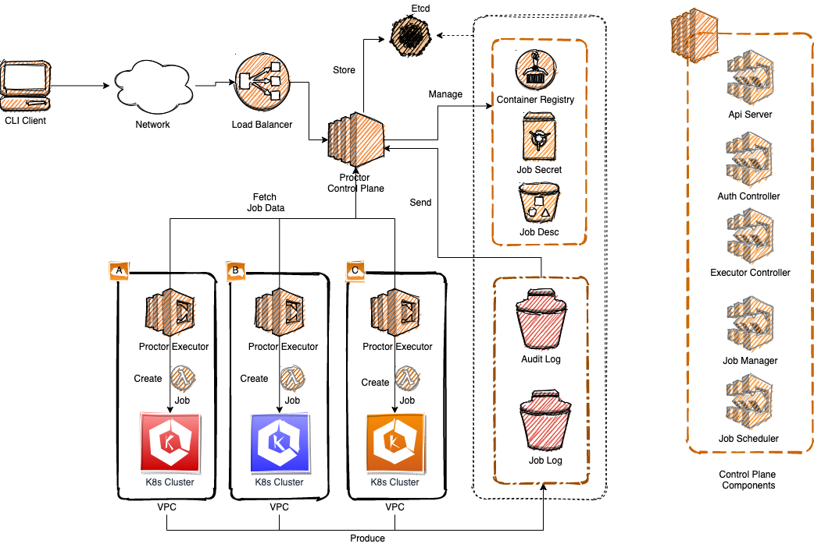
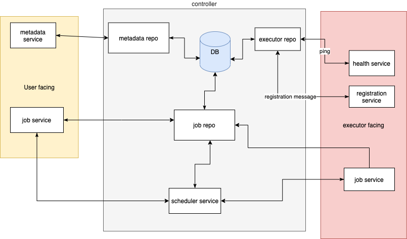
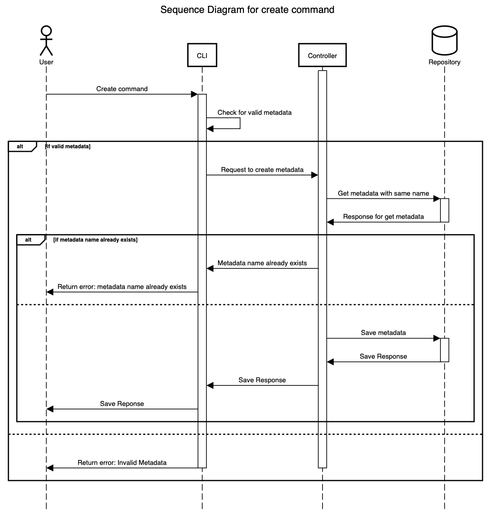
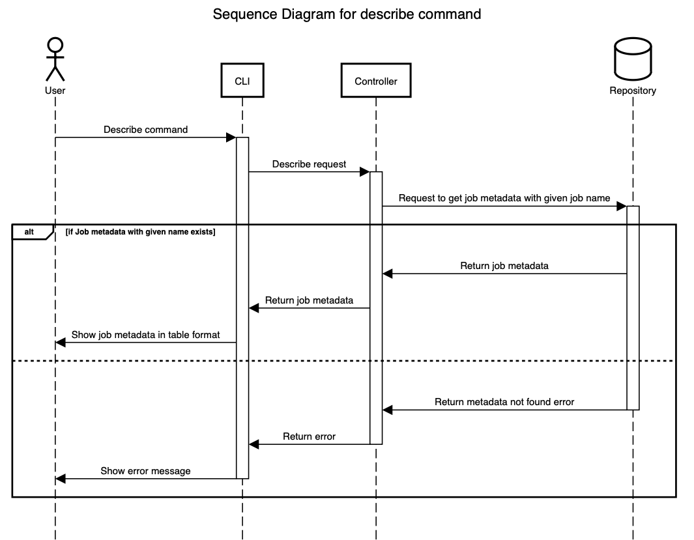
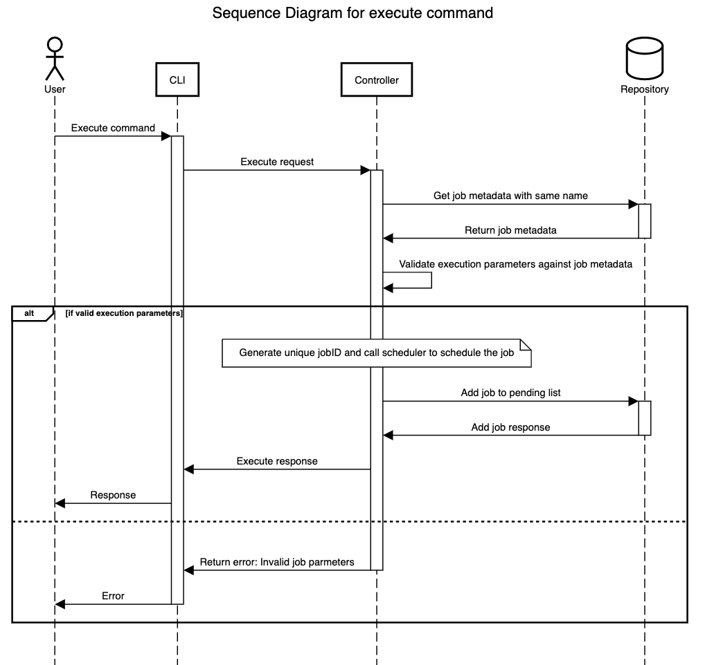
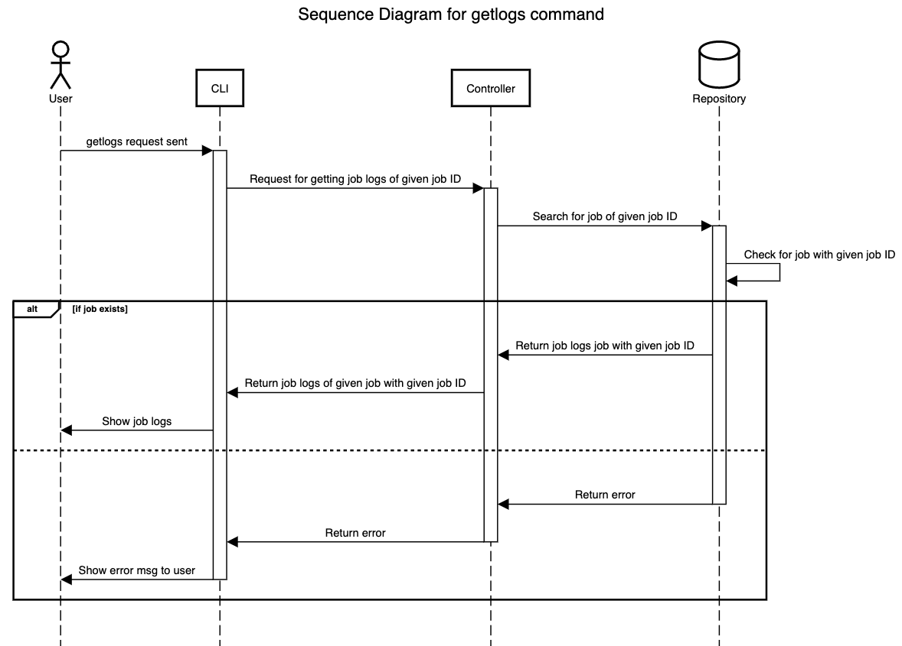
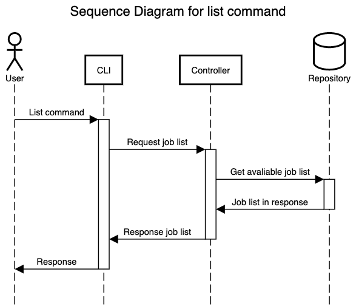
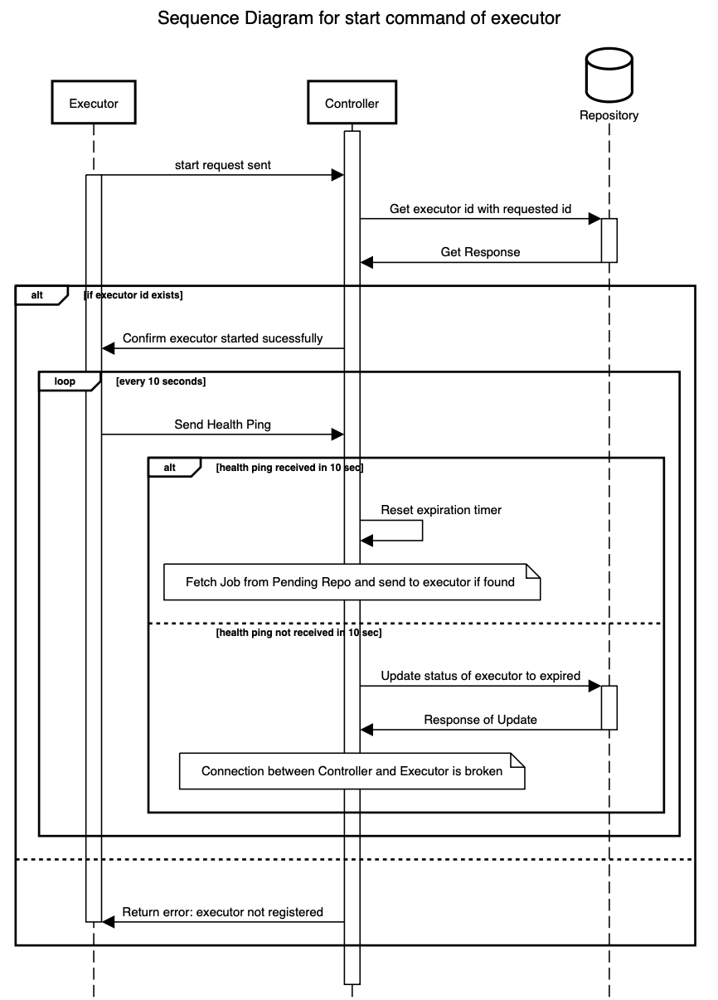
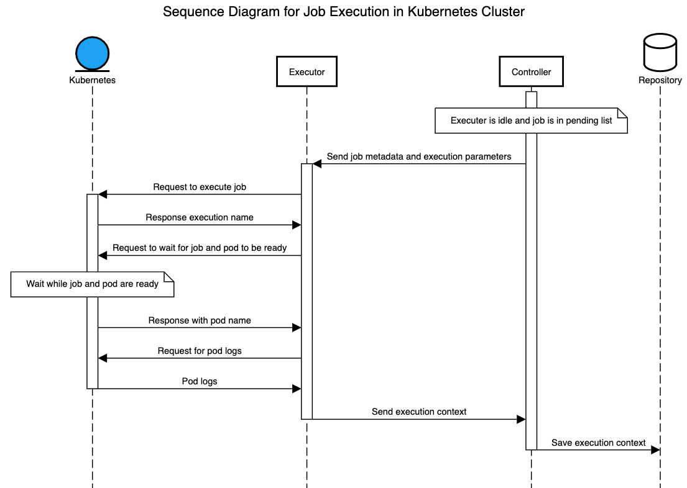

# OCTAVIUS

<p align="center"></p>

- [Description](#description)
- [Sequence Diagrams](#sequence-diagrams)
- [Prerequisites](#prerequisites)
- [Development](#development)
- [Testing](#testing)
- [TODO](#todo)
- [Contributing](#contribution-guidelines)
- [Troubleshoot](#troubleshoot)

---


## Description

The new version of gojek proctor, primarily used for automating tasks in kubernetes cluster. The architecture is inspired by Kubernetes in terms of Control Plane, Storage (single Etcd), API Server, and CLI Client. We have also taken inspirations from Gitlab Runner in terms of keeping a Decentralized executor. 

The architecure uses `gRPC` as the messaging protocol and is entirely written in `Golang`. `etcd` is used as the database and `kubernetes` is used as the container orchestration service.

### Architecture Diagram -:




Lets discuss a bit about the major entities that are present in octavius-:

1. Cli-client - The user-facing entity that will be used to make all the requests to octavius. It is a cli based application that accepts specific commands with or without arguments and should returns an output. The list of commands presently supported by the octavius client is-:

    - `config` - It is used to configure the client so that all the subsequent requests are made to a proper host and with proper authentication parameters. The user is needed to create a yaml file. You can find a template `octavius_client.yaml` file [here](./job_data_example/config/octavius_client.yaml)

    - `create` - It is used to create a job. The job creation can only be done by users with administrator priviledges. Jobs can be executed only after they are created by an admin. To create a job an admin first creates a `metadata.json` defining the metadata associated with the job. You can find a template `metadata.json` file [here](./job_data_example/metadata/metadata.json).

    - `describe` - It is used to describe a job. A user is presented with a structured table that helps him to understand all the important parameters associated with a job. He can then use this information to make a job execution using the `execute` command.

    - `list` - It is used to list all the job registered by octavius.

    - `execute` - It is used to execute a job. To execute a job the user is needed to pass in all the required arguments that are needed for the job execution. To get a description of the job and the arguments needed for execution one can use the `describe` command.

    - `getlogs` - It is used to fetch the job logs after the job execution. When a request to `execute` is made the user is returned with a job ID which he can use in this command to get the execution logs for that particular job.


2. controller - The controller is the heart of octavius. It is the site that is responsible for creation and execution of jobs and then assigning them to an active executor. The data is persisted in a distributed etcd cluster.


### Data Flow Diagram (level 1) -:


When we start the contoller the controller_config.json is read and the environment variables are taken to intialise the present execution. Head over the [controller_config.json](./controller_config.json) to know more.


3. executor - The executor is a decentralised entity which fetches jobs from the controller and after executing them in a kuberentes cluster returns the output logs. Multiple executors can be hosted on different VPCs so that octavius does not suffer when one of the service goes down. Here are the list of commands supported by the executor -:

     - `register` - This command is used to register the executor to controller. Before using an executor we need to register it to the contoller so that all the subsequent requests can be authenticated. The [executor_config.json](./executor_config.json) is read and all the necessary variables needed to the initialization of executor are taken.

     - `start` - This command is used to start the services of executor. When we execute start a ping is setup at a regular intervals to the contoller that tells the controller that executor is still active. There is a corresponding ping deadline at the controller side, if skipped, the executor is marked as `expired`. 

     The executor also makes a fetch request to the contoller at a predefined interval and in this way jobs are fetched by an idle executor.

## Sequence Diagrams

### create command

<p align="center"></p>

### describe command

<p align="center"></p>

### execute command

<p align="center"></p>

### getlogs command

<p align="center"></p>

### list command

<p align="center"></p>

### starting executor

<p align="center"></p>

### kubernetes job execution

<p align="center"></p>


## Prerequisites
(for mac users)

1. golang
2. Docker
3. Setting up etcd container

```zsh
    docker run -d --name etcd-server \
    --publish 2379:2379 \
    --publish 2380:2380 \
    --env ALLOW_NONE_AUTHENTICATION=yes \
    --env ETCD_ADVERTISE_CLIENT_URLS=http://etcd-server:2379 \
    bitnami/etcd:latest
```
4. protobuf
```zsh
    brew install protobuf
```
5. protoc-gen-go
```zsh
    go get -u github.com/golang/protobuf/{proto,protoc-gen-go}
```

## Development

Clone the package from github and generate the executable binaries.

```zsh
git clone https://github.com/gopay-bootcamp/octavius.git`

cd octavius

make build
```

To run the controller -:

`_output/bin/controller start`

To run the executor -:

`_output/bin/executor start`

To run the client -:

`_output/bin/cli <command> <args>`

## Testing

To run the tests use go testing tool

```zsh
go test -race ./...
```

## TODO

While building the decentralised architecture for octavius we know some of the areas that can be improved and should be worked upon to make the application do what it should do, only better. We have added a list of TODO tasks into [laundrylist.md](./docs/laundrylist.md) to keep them organised.

## Contribution Guidelines

Contributions are welcomed! Please read the [contributing.md](./docs/contributing.md) before making one.

## Troubleshoot

1. Refrain from using `github.com/gogo/protobuf` and instead use `github.com/golang/protobuf` as previous one is failing when marshalling proto messages from string.

2. gRPC version `>=1.30.x` has a name conflict with etcd. As a result it is better to stick to grpc `1.27.0` for the foreseeable future unless the upstream resolve their conflicts.


