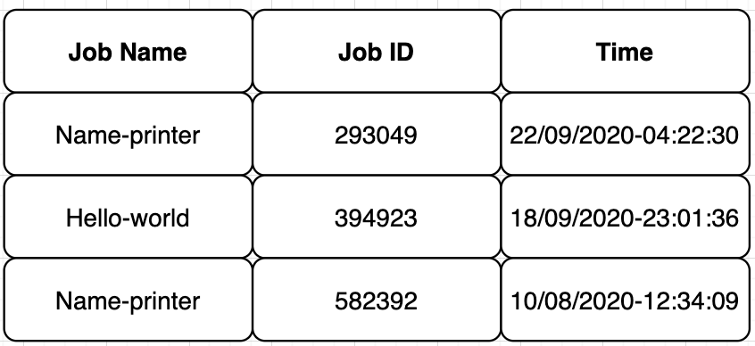

# TODOs

1. Add Authentication and Authorization support that can differentiate the admin and rest of the users. 

2. Add support to handle multiple executors and schedule jobs using different strategies. Presently we support a single executor with FCFS strategy.

3. Add update and delete metadata functionality (Authentication required before this).

4. There should be one command that accept clientID as input and print all jobID of jobs that executed by that client, this will useful in the case when client want to get job logs but forgot the jobID that provided at the time of job execution. Output of that command can be a table like below

5. Currently we are showing empty logs while job is in running state, instead of we have to shows logs there are generated till that point of time.
I observed that kubectl logs <pod-name> gives the logs of running pods. So this can be good user experience. 